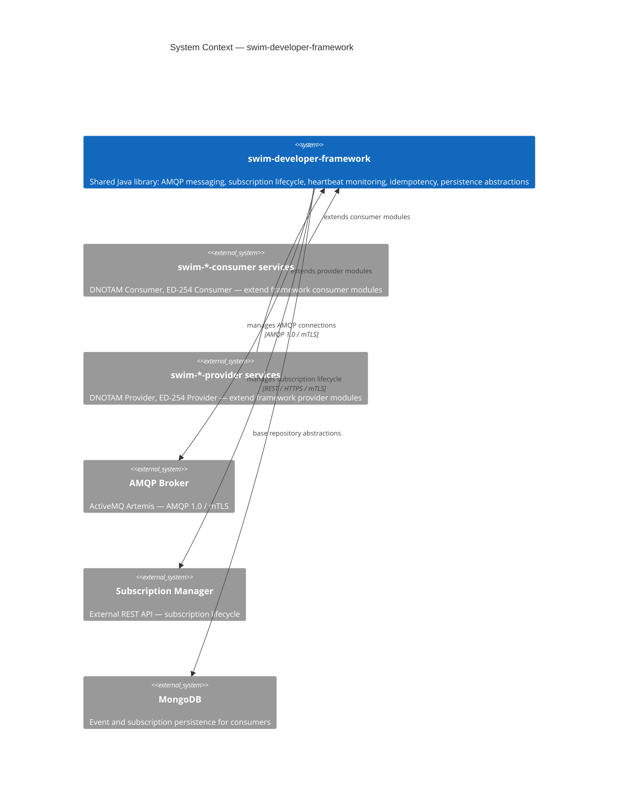
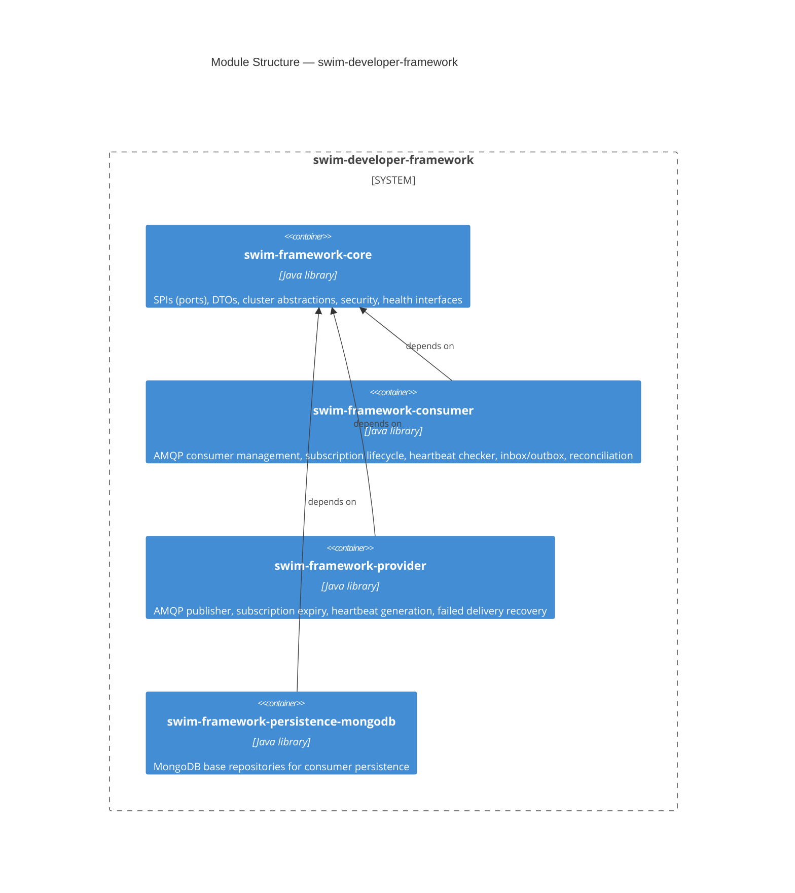
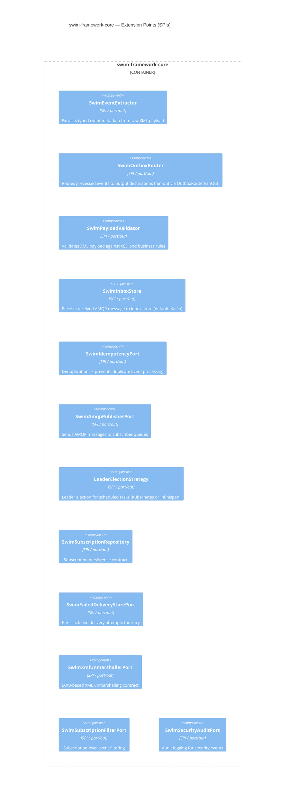
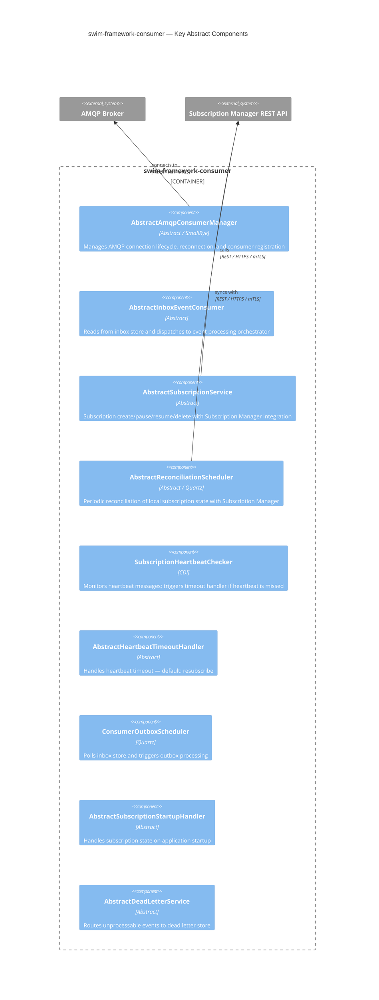
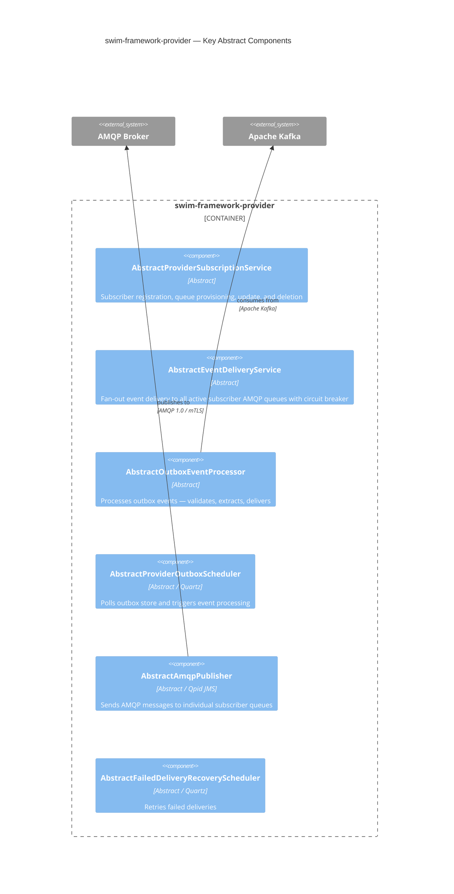
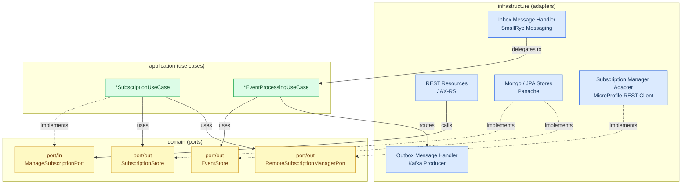

# swim-developer-framework — Architecture

> Diagrams use [Mermaid](https://mermaid.js.org) and render natively on GitHub.

swim-developer-framework is a shared Java library, not a deployable service. It provides the infrastructure skeleton that every SWIM Consumer and Provider needs, so that each service only implements what is unique to its domain.

---

## 1. System Context (C4 Level 1)

---

## 2. Container Diagram (C4 Level 2) — Module Structure

---

## 3. Component Diagram (C4 Level 3) — swim-framework-core SPIs

---

## 4. Component Diagram (C4 Level 3) — swim-framework-consumer Key Abstractions

---

## 5. Component Diagram (C4 Level 3) — swim-framework-provider Key Abstractions

---

## 6. Hexagonal Dependency Rule

All services built on swim-framework follow the same dependency rule. Dependencies always point inward — infrastructure depends on ports, never the reverse.

