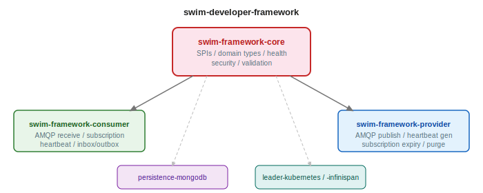

# swim-developer-framework



Shared infrastructure for building SWIM services. This framework extracts the common concerns that every SWIM Consumer and Provider needs, subscription lifecycle, AMQP messaging, heartbeat monitoring, self-healing, leader election, persistence, so that each new service only implements what is specific to its domain.

The framework was validated by building two service families on it: DNOTAM (AIXM 5.1.1) and ED-254 Arrival Sequence (FIXM 4.3). No infrastructure code was copied between them, only domain-specific implementations were written against the framework's SPIs.

## Modules

| Module | What it does |
|--------|-------------|
| [swim-framework-core](swim-framework-core/) | SPIs, domain models, health checks, security, messaging patterns, validation |
| [swim-framework-consumer](swim-framework-consumer/) | Subscription lifecycle, multi-provider AMQP connections, inbox/outbox, heartbeat tracking, auto-renewal, self-healing |
| [swim-framework-provider](swim-framework-provider/) | AMQP publishing, per-subscription heartbeat generation, subscription expiry and purge, queue provisioning |
| [swim-framework-persistence-mongodb](swim-framework-persistence-mongodb/) | MongoDB adapter for consumer subscription and dead letter persistence |
| [swim-framework-leader-kubernetes](swim-framework-leader-kubernetes/) | Leader election via Kubernetes Lease API |
| [swim-framework-leader-infinispan](swim-framework-leader-infinispan/) | Leader election via Infinispan distributed cache |

## How it works

A SWIM service implements a small set of SPIs defined in `swim-framework-core`. The framework handles the rest:

```
Your service implements:          The framework provides:
                                  
  SwimEventExtractor<T>            Subscription lifecycle
  SwimOutboxRouter                 AMQP connection management
  SwimPayloadValidator             Heartbeat monitoring
  SwimSubscription<E>              Self-healing and reconnection
  SwimIngressHandler               Inbox/outbox event processing
                                   Leader election
                                   Health checks and metrics
                                   TLS certificate reloading
                                   Queue provisioning
```

## GET STARTED

### Prerequisites

- Java 21
- Maven 3.9+
- Podman (or any OCI-compatible runtime, Testcontainers auto-detects)

### Build and install

```bash
./mvnw clean install -DskipTests
```

This installs all modules to your local Maven repository. Downstream services declare this as a BOM and pull individual modules:

```xml
<dependencyManagement>
    <dependencies>
        <dependency>
            <groupId>com.github.swim-developer</groupId>
            <artifactId>swim-framework</artifactId>
            <version>1.0.0-SNAPSHOT</version>
            <type>pom</type>
            <scope>import</scope>
        </dependency>
    </dependencies>
</dependencyManagement>

<dependencies>
    <!-- Consumer service: pull only what you need -->
    <dependency>
        <groupId>com.github.swim-developer</groupId>
        <artifactId>swim-framework-consumer</artifactId>
    </dependency>
    <dependency>
        <groupId>com.github.swim-developer</groupId>
        <artifactId>swim-framework-persistence-mongodb</artifactId>
    </dependency>
</dependencies>
```

### Run tests

```bash
# Unit tests only
./mvnw test

# Unit + integration tests (Testcontainers, auto-detects Podman/Docker)
./mvnw verify -DskipITs=false
```

Integration tests spin up Redpanda (Kafka-compatible), MongoDB, and ActiveMQ Artemis via Testcontainers automatically.

> **Podman users**: Testcontainers auto-detects Podman via `DOCKER_HOST`. If tests fail to start containers, run `podman system service --time=0 &` or set `DOCKER_HOST=unix:///run/user/$(id -u)/podman/podman.sock`.

### Implement against the framework

Your service only needs to implement the SPIs from `swim-framework-core`:

```java
// 1. Extract your domain object from an AMQP message
public class DnotamEventExtractor implements SwimEventExtractor<DnotamEvent> { ... }

// 2. Route processed events to the right outbox channel
public class DnotamOutboxRouter implements SwimOutboxRouter { ... }

// 3. Validate incoming XML payloads
public class DnotamPayloadValidator implements SwimPayloadValidator { ... }
```

The framework handles everything else: subscription lifecycle, AMQP connection management, inbox/outbox, heartbeat monitoring, self-healing, and health checks.

## Development tasks

The `Makefile` at the root of this project wraps the most common development workflows:

| Target | What it does |
|--------|-------------|
| `make install` | Builds all modules and installs them to the local Maven repository |
| `make test` | Runs unit + integration tests (Testcontainers spins up Redpanda, MongoDB, Artemis automatically) |
| `make sonar-up` | Starts SonarQube at http://localhost:9000 and waits until ready |
| `make sonar` | Runs static analysis (requires `sonar-up` first) |
| `make sonar-down` | Stops SonarQube |
| `make security-deps` | OWASP Dependency-Check -- report at `target/dependency-check-report.html` (see note below) |

SonarQube runs with authentication disabled (`SONAR_FORCEAUTHENTICATION=false`) -- no token or account needed. Results are published to http://localhost:9000 under project `swim-framework`.

> To point to a remote SonarQube with auth enabled: `make sonar SONAR_TOKEN=<token>`.

### OWASP Dependency-Check

Without an NVD API key, the tool downloads the entire National Vulnerability Database (347,000+ records) which takes over one hour.

Get a free key at https://nvd.nist.gov/developers/request-an-api-key (instant registration).

The recommended way is to create a `.env.owasp` file in the project root (already in `.gitignore`):

```
NVD_API_KEY=your-key-here
```

`make security-deps` loads this file automatically. Alternatively, pass the key on the command line:

```bash
make security-deps NVD_API_KEY=<your-key>
```

The NVD database is cached locally after the first download. Subsequent runs with the same key are fast.

## Technology

| Component | Version |
|-----------|---------|
| Quarkus | 3.34.6 |
| Java | 21 |
| Vert.x AMQP Client | (managed by Quarkus BOM) |
| MongoDB Panache | (managed by Quarkus BOM) |
| Kubernetes Client | (managed by Quarkus BOM) |
| Infinispan Client | (managed by Quarkus BOM) |

## License

Licensed under the [Apache License 2.0](LICENSE).
